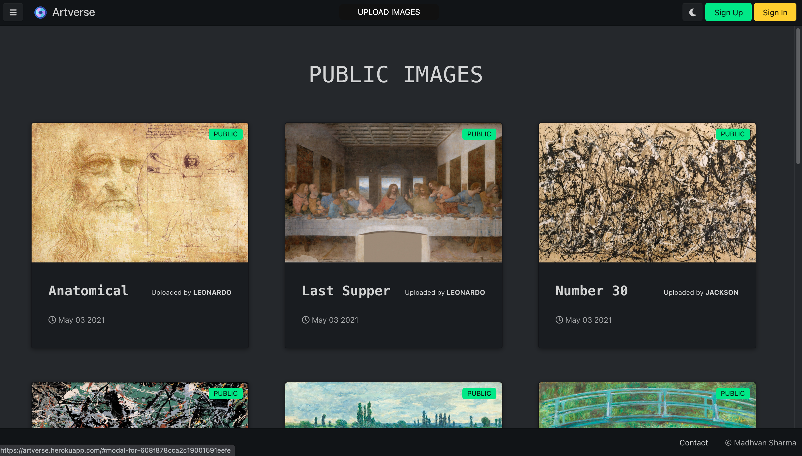
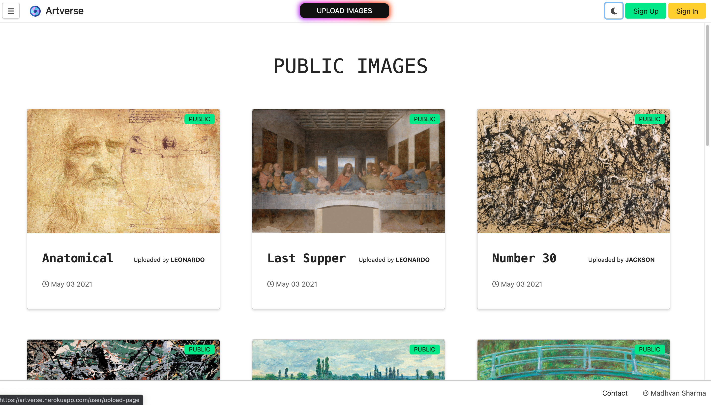
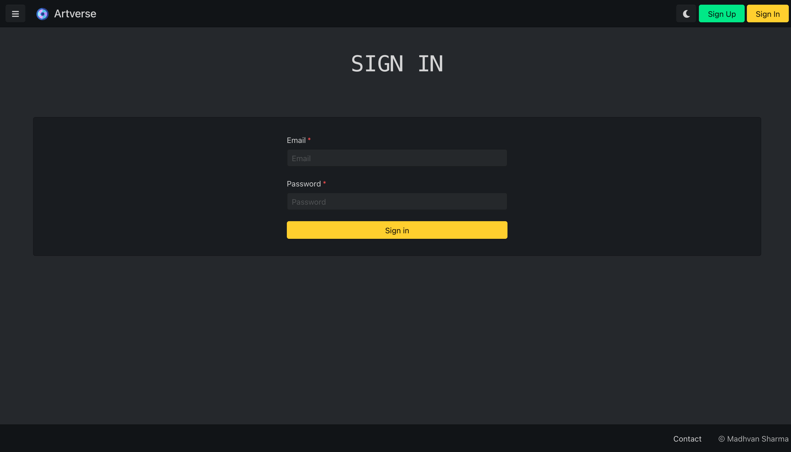
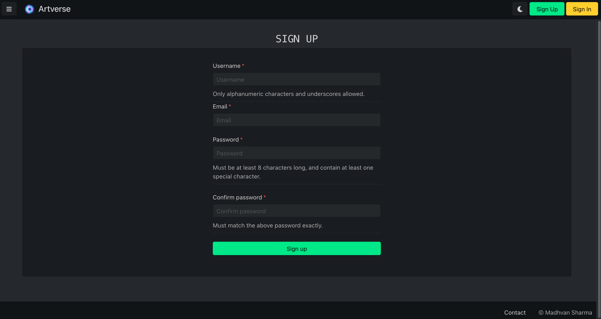
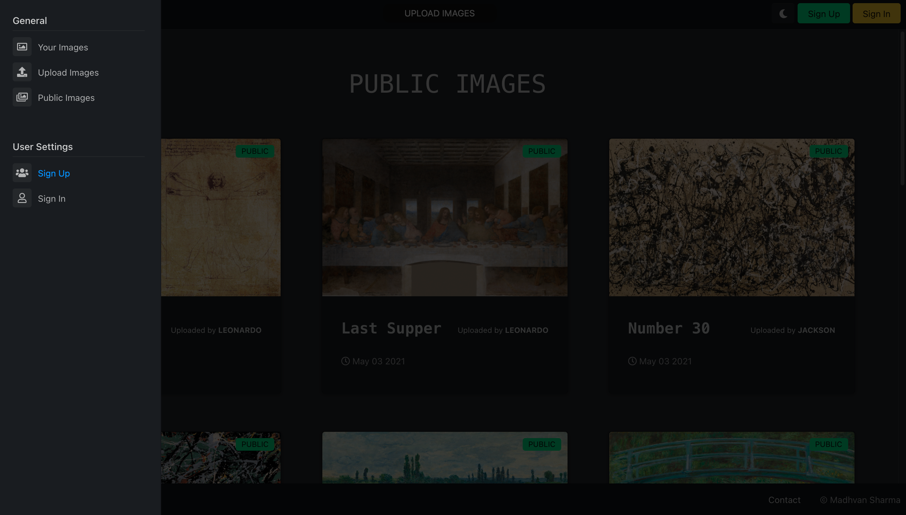
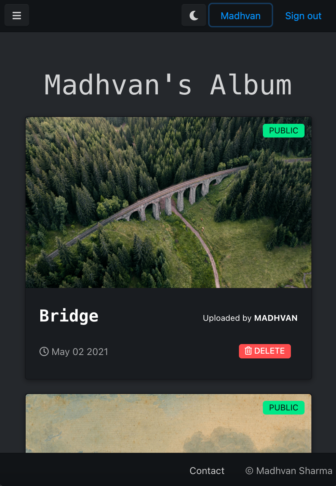
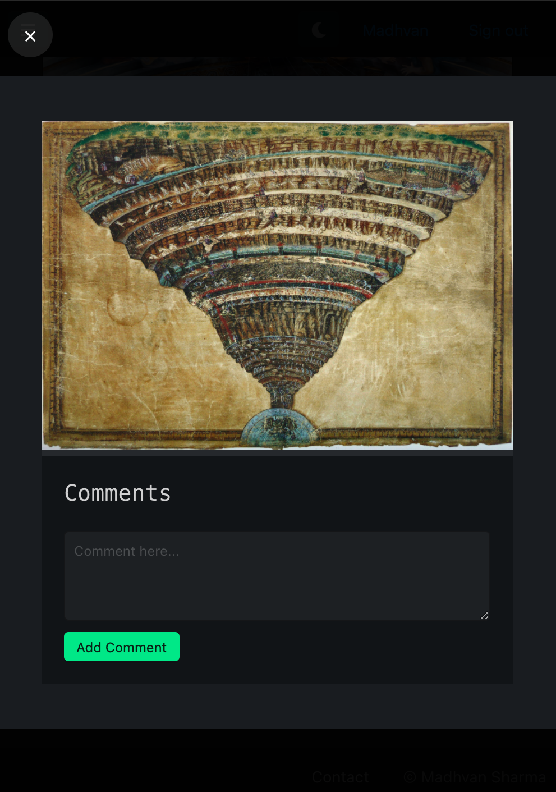

# Artverse

**Artverse** is a Web application where people can share images. It allows artists from different parts of the world to showcase their talent and it also provides a platform for convenient access of their images.

This web application has been made using ****Desktop**-**first** Responsive Strategy** and has **dark mode** available. 

Users can upload their images and *add it to their private album or keep it public.* This feature allows users to keep their family photos at a cloud storage so that they can be accessed digitally from anywhere in the world. Users can also share their views on different images by *adding comments* on images, *view* different images and much more.

# Running the Project

#### The live version of this project can be accessed at : 

#### &emsp;<https://artverse.herokuapp.com>

#### For running this project locally:

 1. Clone this project locally
 2. Make an `.env` file and add the environment variables in it.
 3. Run `npm install` in your bash/command line.
 4. Run `npm start` in your bash/command line.
 5. Upload some images and enjoy!!
 

# Built with

### Languages used:

 - HTML
 - CSS
 - JavaScript
 - [EJS Templating Language](https://ejs.co/)
 - Node.js *(Javascript runtime engine)*
 
 ### Frameworks and Libraries used:
 
 - [Halfmoon UI](https://www.gethalfmoon.com/)
 - [Express.js](https://expressjs.com/)
 - [Passport.js](http://www.passportjs.org/)
 - [Mongoose (ODM)](https://mongoosejs.com/)
 - [Multer](https://www.npmjs.com/package/multer)
 - [Cloudinary](https://cloudinary.com/)
 - [FontAwesome icons](https://fontawesome.com/)

# Contact

[Madhvan Sharma](https://www.linkedin.com/in/madhvan-sharma/) - madhvan.sharma28@gmail.com

**Project Link :** https://github.com/Madhvan-Sharma/Artverse